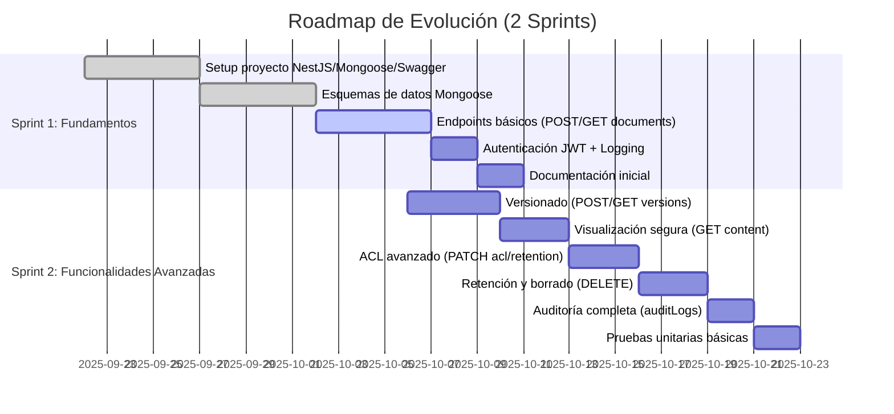

# DESIGN.md - Document Manager Microservice

Este documento detalla el diseño y la arquitectura propuestos para el microservicio de gestión documental.

## 1. Modelado de Datos (MongoDB + Mongoose)

El modelo de datos se ha diseñado para ser escalable y flexible, utilizando colecciones separadas para documentos, versiones y registros de auditoría. Se ha optado por MongoDB y Mongoose para el esquema de datos, lo que permite un enfoque orientado a documentos que se adapta bien a la naturaleza no relacional del problema.

### Colección: `documents`
Esta colección almacena los metadatos principales de cada documento.
- `_id`: `ObjectId` - Identificador único del documento.
- `customerId`: `String` - Identificador del cliente o tenant. Se usa para aislamiento de datos. La prueba sugiere este tipo de dato.
- `processId?`: `String` - (Opcional) Identificador de un proceso o workflow externo.
- `taxonomy`: `Object` - Un objeto para clasificar el documento.
  - `domain`: `String` - Dominio (e.g., 'Legal', 'Finanzas').
  - `category`: `String` - Categoría (e.g., 'Contratos', 'Facturas').
  - `docType`: `String` - Tipo de documento (e.g., 'PDF', 'XML').
- `currentVersion`: `ObjectId` - Referencia a la versión más reciente en la colección `documentVersions`. Esto optimiza la consulta para obtener los metadatos de la versión actual directamente, como sugiere el documento de la prueba.
- `acl`: `Object` - Control de Acceso por Lista a nivel de documento.
    - `owners`: `[String]` - IDs de usuarios con control total.
    - `readers`: `[String]` - IDs de usuarios con permiso de lectura.
    - `updaters`: `[String]` - IDs de usuarios con permiso para actualizar.
    - `roles`: `[String]` - Roles de usuario con permisos específicos.
- `retention`: `Object` - Configuración de la política de retención.
    - `policyId?`: `String` - (Opcional) ID de una política de retención.
    - `deleteAt?`: `Date` - Fecha de eliminación programada.
    - `mode`: `String` - 'SOFT' | 'HARD'.
- `createdAt`: `Date` - Fecha de creación del documento.
- `updatedAt`: `Date` - Fecha de la última actualización de metadatos.
- `deletedAt?`: `Date` - Fecha del borrado lógico (`SOFT delete`).

### Colección: `documentVersions`
Almacena los metadatos específicos de cada versión de un documento.
- `_id`: `ObjectId`
- `documentId`: `ObjectId` - Referencia al `_id` en la colección `documents`.
- `version`: `Number` - Consecutivo (1, 2, 3...).
- `filename`: `String`.
- `mimeType`: `String`.
- `size`: `Number`.
- `hash?`: `String` - Checksum del binario para verificación de integridad.
- `storageKey`: `String` - Clave de referencia al binario en el almacenamiento.
- `createdBy`: `String` - ID del usuario que creó la versión. El documento lo define como `createdBy` de tipo `String`.
- `createdAt`: `Date`.

### Colección: `auditLogs`
Registra todas las acciones clave realizadas sobre los documentos para la auditoría.
- `_id`: `ObjectId`
- `documentId`: `ObjectId` - Referencia al `_id` en la colección `documents`.
- `version?`: `Number` - (Opcional) Versión del documento si la acción es específica a una versión.
- `action`: `String` - Ej. 'CREATE', 'READ', 'ACL_UPDATE'.
- `actorId`: `String` - ID del usuario que ejecuta la acción.
- `roles?`: `[String]` - Roles del actor al momento de la acción.
- `ip`: `String`.
- `userAgent`: `String`.
- `timestamp`: `Date`.
- `result`: `String` - 'SUCCESS' | 'FAILURE'.
- `reason?`: `String` - (Opcional) Explicación del resultado.

### Índices Propuestos
Los índices son cruciales para el rendimiento de las consultas y se han diseñado para las operaciones más comunes.
- `documents`: `{ customerId: 1, 'taxonomy.domain': 1, 'taxonomy.category': 1 }` (para filtrado eficiente)[cite: 55]. `{ 'retention.deleteAt': 1 }` (esencial para el proceso de borrado periódico)[cite: 55]. `{ 'acl.readers': 1 }` (para buscar documentos por los permisos de un usuario).
- `documentVersions`: `{ documentId: 1, version: 1 }` (índice compuesto para asegurar la unicidad y optimizar la búsqueda de versiones)[cite: 55].
- `auditLogs`: `{ timestamp: 1 }` (para orden cronológico de eventos)[cite: 55]. `{ documentId: 1 }` (para auditoría específica por documento)[cite: 55].

## 2. Contratos API (Swagger/OpenAPI)

El microservicio expone los siguientes endpoints.
Todos los endpoints requieren autenticación vía **JWT Bearer Token**, y la autorización se valida a través del modelo de ACL definido en la sección anterior.

---

### 2.1 Documentos

#### POST /documents
Crea un nuevo documento. La subida del archivo binario se maneja por separado.

**Request DTO**
```ts
class CreateDocumentDto {
  customerId: string;
  processId?: string;
  taxonomy: {
    domain: string;
    category: string;
    docType: string;
  };
}
```
**Responses**

- 201 Created → Retorna metadata del documento creado, incluyendo documentId.

- 400 Bad Request → Validación fallida.

- 409 Conflict → Conflicto de datos (ej. documento ya existente).

#### GET /documents/:id
Obtiene los metadatos de un documento por su ID.

**Responses**

- 200 OK → Retorna metadata del documento, incluyendo la versión actual y su ACL.

- 404 Not Found → Documento no existe.

- 403 Forbidden → Acceso denegado por ACL.

#### GET /documents

Lista documentos con filtros y paginación.

**Query params**

- domain?, category?, docType?, customerId?

- page, limit, sortBy, sortOrder

**Responses**

- 200 OK → Lista paginada de documentos que cumplen con los filtros.

- 403 Forbidden → Acceso denegado.

### 2.2 Versiones

#### POST /documents/:id/versions
Agrega una nueva versión a un documento existente. Esta operación requiere el envío de un archivo binario.

**Request DTO**
```ts
class CreateDocumentVersionDto {
  filename: string;
  mimeType: string;
  size: number;
}
```

**Request Body**
- multipart/form-data con el archivo binario.

**Responses**

- 201 Created → Retorna metadata de la versión creada.

- 404 Not Found → Documento no existe.

- 403 Forbidden → Acceso denegado.

- 409 Conflict → Conflicto de versión (ej. hash duplicado).

#### GET /documents/:id/versions
Lista todas las versiones de un documento.

**Responses**

- 200 OK → Array de versiones con metadatos.

- 404 Not Found → Documento no existe.

- 403 Forbidden → Acceso denegado.

### 2.3 Contenido

#### GET /documents/:id/content?version?

Descarga o visualiza el contenido de un documento.
Si no se indica version, se obtiene la versión actual.

**Headers**

- Authorization: Bearer <jwt>

**Responses**

- 200 OK → Retorna binario con headers seguros (Cache-Control: no-store, Content-Disposition: attachment|inline).

- 403 Forbidden → Acceso denegado.

- 404 Not Found → Documento o versión no existe.

### 2.4 Seguridad y Retención
#### PATCH /documents/:id/acl
Actualiza las reglas de ACL de un documento.

**Request DTO**
```ts
class UpdateAclDto {
  owners?: string[];
  readers?: string[];
  updaters?: string[];
  roles?: string[];
}
```

**Responses**

- 200 OK → ACL actualizada.

- 404 Not Found → Documento no existe.

- 403 Forbidden → Acceso denegado.

#### PATCH /documents/:id/retention
Configura o actualiza la política de retención de un documento.

**Request DTO**
```ts
class UpdateRetentionDto {
  policyId?: string;
  deleteAt?: Date;
  mode: 'SOFT' | 'HARD';
}
```

**Responses**

- 200 OK → Retención actualizada.

- 422 Unprocessable Entity → Parámetros inválidos de retención.

- 404 Not Found → Documento no existe.

#### DELETE /documents/:id

Elimina un documento siguiendo su política de retención (SOFT o HARD delete). La acción inicia un proceso de borrado.

**Responses**

- 202 Accepted → La solicitud de borrado ha sido aceptada y se procesará asíncronamente según la política de retención.

- 404 Not Found → Documento no existe.

- 403 Forbidden → ACL denegada.

### 2.5 Códigos de error estándar

- 400 Bad Request → Validación fallida.

- 401 Unauthorized → JWT inválido o ausente.

- 403 Forbidden → ACL denegada.

- 404 Not Found → Documento o versión no existe.

- 409 Conflict → Conflictos de versiones o ACL.

- 422 Unprocessable Entity → Parámetros inválidos (ej. retención).

- 500 Internal Server Error → Error inesperado en el servidor.

## 3. ACL por Documento (Access Control List)

El control de acceso se define a nivel de documento y se almacena en el campo `acl` dentro de la colección `documents`.  
El modelo soporta tanto **usuarios individuales** como **roles globales**, permitiendo granularidad y flexibilidad.

### 3.1 Modelo ACL
El objeto `acl` tiene la siguiente estructura incrustada en cada documento:
```json
"acl": {
  "owners": ["user123"],
  "readers": ["user456", "user789"],
  "updaters": ["user999"],
  "roles": ["ADMIN", "AUDITOR"]
}
```

- owners: [String] - IDs de usuarios con control total sobre el documento. Tienen permiso para todas las acciones: read, update de metadatos, upload de nuevas versiones, update de ACL y delete.

- readers: [String] - IDs de usuarios con acceso de solo lectura. Pueden ver los metadatos del documento y descargar su contenido.

- updaters: [String] - IDs de usuarios con permisos para modificar los metadatos del documento y subir nuevas versiones.

- roles: [String] - Nombres de roles globales que heredan permisos predefinidos, lo que facilita la gestión de permisos para grupos de usuarios.

### 3.2 Evaluación de permisos

El sistema evalúa los permisos en cada solicitud para determinar el acceso. El flujo de autorización es el siguiente:

**Autenticación:** El microservicio valida el JWT Bearer Token para identificar al usuario (actorId) y obtener sus roles asociados.

**Evaluación de la ACL:** El sistema verifica si el actorId o cualquiera de sus roles se encuentra en los arrays de owners, readers, updaters o roles del documento.

**Decisión de Acceso:** El permiso se concede si se cumple alguna de las siguientes condiciones, basándose en el tipo de operación:

- Acceso a metadatos (GET /documents, GET /documents/:id): El actorId o su rol debe estar en owners, readers, updaters o roles.

- Acceso al binario (GET /documents/:id/content): El actorId o su rol debe estar en owners, readers o roles.

- Actualización (PATCH, POST de versiones): El actorId o su rol debe estar en owners o updaters.

- Modificación de ACL/Retención (PATCH): El actorId debe ser un owner o tener un rol administrativo (ADMIN) con privilegios.

- Eliminación (DELETE): El actorId debe ser un owner o tener un rol administrativo (ADMIN).

Si no se cumple ninguna de estas condiciones, se retorna una respuesta 403 Forbidden.

### 3.3 Ejemplos de decisión

**Ejemplo 1: Usuario user-A intenta ver un documento (GET /documents/:id)**

- ACL del documento: acl.readers incluye "user-A".

- Resultado: Acceso concedido.

**Ejemplo 2: Usuario user-B intenta subir una nueva versión (POST /documents/:id/versions)**

- ACL del documento: acl.updaters incluye "user-B".

- Resultado: Acceso concedido.

**Ejemplo 3: Usuario user-C intenta actualizar la ACL (PATCH /documents/:id/acl)**

- ACL del documento: acl.updaters incluye "user-C".

- Resultado: Acceso denegado. La modificación de la ACL es exclusiva para owners.

### 3.4 Consideraciones adicionales

- **Herencia de roles:** Se asume que los roles globales se gestionan en un servicio de autenticación central, que es el que proporciona la lista de roles del usuario al microservicio.

- **Multi-tenant:** La evaluación de permisos siempre se realiza en el contexto del customerId para evitar el acceso a documentos de otros clientes, garantizando el aislamiento de datos.

- **Auditoría:** Todas las decisiones de ACL, tanto los accesos permitidos como los denegados, se registran en la colección auditLogs para mantener un rastro completo de las operaciones de seguridad.


## 4. Visualización Segura

El microservicio debe garantizar que el contenido de los documentos se entregue de forma controlada, evitando fugas de información y asegurando que el acceso sea siempre autenticado y auditado. El mecanismo de visualización segura se implementa a través de un endpoint protegido que actúa como un proxy seguro, evitando la exposición de las URLs directas del almacenamiento. 

### 4.1 Endpoint seguro
El contenido se expone únicamente a través del endpoint:

**GET /documents/:id/content?version?**

- **Autenticación y Autorización:** Cada solicitud a este endpoint requiere un **JWT Bearer Token** válido. Antes de entregar el binario, el microservicio valida que el usuario autenticado tiene los permisos de lectura (readers, owners o un rol autorizado) sobre el documento, como se especifica en la sección de **ACL por Documento**.

- **Mecanismo de Streaming:** El microservicio obtiene el binario desde un **bucket privado de S3** usando credenciales internas y seguras. El archivo se transmite al cliente en chunks (stream), sin ser almacenado en el servidor del microservicio, garantizando la seguridad y el rendimiento.

### 4.2 Headers anti-cache
Para evitar que los documentos queden almacenados en cachés de navegador o proxies intermedios, se envían los siguientes headers de seguridad en cada respuesta. Esto asegura que cada acceso requiera autenticación y autorización en tiempo real, garantizando la frescura y el control de la información.

- `Cache-Control: no-store, no-cache, must-revalidate, proxy-revalidate`  
- `Pragma: no-cache`  
- `Expires: 0`  

### 4.3 Control de Visualización vs. Descarga
El header `Content-Disposition` se utiliza para indicar al navegador cómo manejar el archivo, permitiendo la visualización segura (inline) o la descarga controlada (attachment).

- **Visualización segura en navegador (inline)**  
  ```http
  Content-Disposition: inline; filename="document.pdf"
  ```

El documento se abre en el navegador. Ideal para PDFs o imágenes, evitando que el archivo sea guardado en el dispositivo del usuario sin su consentimiento.

- Descarga controlada (attachment)

  ```http
  Content-Disposition: attachment; filename="document.pdf"
  ```
  Fuerza al navegador a mostrar un cuadro de diálogo de descarga. Esto es útil para archivos que el navegador no puede renderizar o cuando la intención es que el usuario guarde el archivo.

La elección entre inline y attachment puede definirse a nivel de aplicación o basarse en las reglas de negocio (por ejemplo, el rol del usuario).

### 4.4 Flujo del Mecanismo de Visualización Segura

El proceso de entrega del binario es simple y robusto, garantizando trazabilidad y seguridad completa.

- **Solicitud del Cliente:** El cliente realiza una petición GET al endpoint seguro con un JWT en el header Authorization.

- **Validación y Auditoría:** El microservicio valida el JWT y ejecuta la lógica de ACL. El resultado de la decisión (acceso permitido o denegado) se registra de inmediato en la colección auditLogs.

- **Obtención y Streaming:** Si se concede el acceso, el microservicio utiliza sus credenciales internas para obtener el binario del almacenamiento de objetos.

- **Entrega Segura:** El binario se streamea directamente al cliente, con los headers anti-cache y de Content-Disposition adecuados.

 ````mermaid 
sequenceDiagram
    participant User
    participant API as Document API
    participant S3 as Storage

    User->>API: GET /documents/:id/content (JWT)
    API->>API: Validar JWT + ACL
    alt ACL válida
      API->>S3: Obtener binario con credenciales internas
      S3-->>API: Retorna binario
      API-->>User: Stream con headers no-cache + inline/attachment
      API->>API: Registrar acción en auditLogs
    else ACL inválida
      API-->>User: 403 Forbidden
      API->>API: Registrar intento de acceso fallido en auditLogs
    end
 ````

## 5. Retención y Borrado

El microservicio implementa una política de retención que gestiona el ciclo de vida de los documentos, desde su creación hasta su eliminación final. Este mecanismo es crucial para cumplir con normativas y políticas internas, mientras se asegura la trazabilidad completa de las acciones.

### 5.1 Mecanismo de Retención y Asignación de deleteAt
El campo retention en la colección documents define cuándo y cómo un documento debe ser eliminado. La fecha de eliminación programada, deleteAt, se asigna de la siguiente manera:

- **Política por defecto:** La aplicación puede definir políticas de retención globales o por customerId (tenant) que se aplican automáticamente a los documentos recién creados, basándose en su taxonomy.

- **Asignación manual:** El valor de deleteAt puede ser sobrescrito o asignado manualmente a través del endpoint PATCH /documents/:id/retention, permitiendo a los owners o administradores establecer una fecha de caducidad específica.

Este diseño flexible permite que los documentos sigan una política estándar de la compañía, pero también se puedan gestionar excepciones de forma individual.

### 5.2 Tipos de Borrado: SOFT vs. HARD Delete
Se diferencian dos tipos de eliminación para ofrecer flexibilidad y seguridad:

- **Borrado Lógico (SOFT Delete)**  
  - Al ejecutar DELETE /documents/:id con el mode de retención establecido en 'SOFT', el documento no se elimina físicamente.

  - En su lugar, el campo deletedAt en la colección documents se popula con un timestamp que indica la fecha de la eliminación lógica.

  - Desde la perspectiva de la API, el documento deja de ser accesible para operaciones de lectura o actualización (un GET a este documento retornará un 404 Not Found). Esto mantiene el registro del documento y su historial de auditoría para fines de cumplimiento.  

- **Borrado Físico (HARD Delete)**  
  - El borrado HARD es una operación **asíncrona y destructiva**. Este proceso es irreversible.

  - Implica la eliminación total de los metadatos del documento de la colección documents, de todas sus versiones de documentVersions y, lo más importante, de los binarios correspondientes en el almacenamiento de objetos (S3).

### 5.3 Proceso de ejecución (cron/cola)
La eliminación física de documentos se gestiona por un proceso conceptual externo a la API, para evitar que una operación síncrona afecte el rendimiento. Se pueden usar dos enfoques:

- **Proceso en cron job**: Un job programado se ejecuta periódicamente (por ejemplo, cada 24 horas). Este job escanea la colección documents buscando registros donde la fecha deleteAt sea anterior a la fecha y hora actuales. Por cada documento encontrado, se inicia el proceso de borrado físico.

- **Sistema de Colas**: Al recibir la solicitud DELETE /documents/:id con mode 'HARD', la API no elimina el documento de inmediato. En su lugar, pone un mensaje en una cola de trabajo (ej. RabbitMQ, SQS) con el documentId. Un worker o consumidor de la cola procesa el mensaje de forma asíncrona, eliminando los datos y binarios.

Este diseño asíncrono libera la API de operaciones pesadas y evita timeouts en las peticiones HTTP.

### 5.4 Auditoría de retención y borrado
Todas las acciones relevantes sobre los documentos, incluyendo las relacionadas con la retención y el borrado, se registran en la colección `auditLogs`. Esto asegura una trazabilidad completa.

Se auditarían las siguientes acciones:

- `document_created`: Creación del documento.

- `document_deleted_soft`: Solicitud de borrado lógico.

- `document_deleted_hard`: Solicitud de borrado físico.

- `retention_policy_updated`: Actualización de la política de retención.

- `document_viewed`: Acceso exitoso al binario del documento.

- `access_denied`: Intentos fallidos de acceso por falta de permisos.

Cada log incluye el `documentId`, el `actorId`, el `timestamp` y el `result`, proporcionando un historial completo para fines de auditoría.

## 6. Evolución a 2 Sprints

El microservicio está diseñado con una arquitectura modular que permite una implementación incremental y priorizada. A continuación, se detalla un roadmap realista dividido en dos sprints de 2 semanas cada uno, con un enfoque en la entrega de valor de forma ágil.

### 6.1 Sprint 1: Fundamentos y Funcionalidad Básica
**Objetivo:** Entregar una versión mínima ejecutable (MVP) que permita registrar y consultar documentos con seguridad básica, sentando las bases de la arquitectura.

**Alcance:**
- **Configuración y Setup:** Configuración inicial del proyecto NestJS, Mongoose y Swagger.
- **Diseño de Datos:** Definición e implementación de los esquemas de datos de Mongoose (`documents`, `documentVersions`, `auditLogs`) con sus respectivos índices.
- **Endpoints de Documentos:** Implementación de los endpoints `POST /documents` y `GET /documents/:id`, con respuestas simuladas o stubs para demostrar que la aplicación corre.
- **Seguridad Básica:** Implementación de un guard de autenticación JWT y un mock simple para la validación de la ACL.
- **Logging:** Configuración de un sistema de logging básico con `requestId`.
- **Documentación:** Creación de los archivos `README.md` y `DESIGN.md` con los supuestos y decisiones de diseño.
---

### 6.2 Sprint 2: Seguridad y Funcionalidades Avanzadas
**Objetivo:** Extender el microservicio para cubrir el ciclo de vida completo del documento, incluyendo versionado, retención y la seguridad avanzada.

**Alcance:**
- **Gestión de Versiones:** Implementación de los endpoints `POST /documents/:id/versions` y `GET /documents/:id/versions` para manejar la subida y consulta de múltiples versiones.
- **Visualización Segura:** Implementación del endpoint `GET /documents/:id/content?version?` para la entrega segura del binario con `headers` anti-cache y control de `Content-Disposition`.
- **Control de Acceso y Retención:** Implementación de los endpoints `PATCH /documents/:id/acl` y `PATCH /documents/:id/retention`, así como la lógica para el borrado asíncrono (`DELETE /documents/:id`).
- **Auditoría Completa:** Implementación de la lógica para registrar todas las acciones de seguridad, retención y CRUD en la colección `auditLogs`.
- **Pruebas Unitarias:** Adición de 1-2 pruebas unitarias para validar los DTOs o la lógica pura, como el cálculo de `deleteAt` o la evaluación de ACL.

---

### 6.3 Roadmap Visual (Gantt)
Este diagrama de Gantt visualiza la planificación de los dos sprints de forma cronológica, facilitando la comprensión del orden de las tareas.

